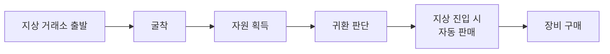
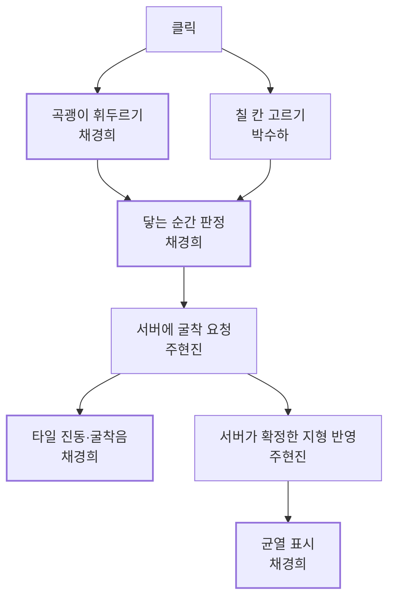
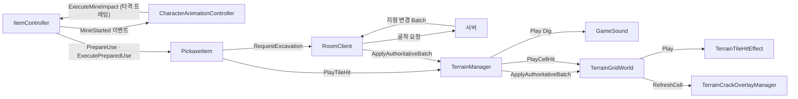
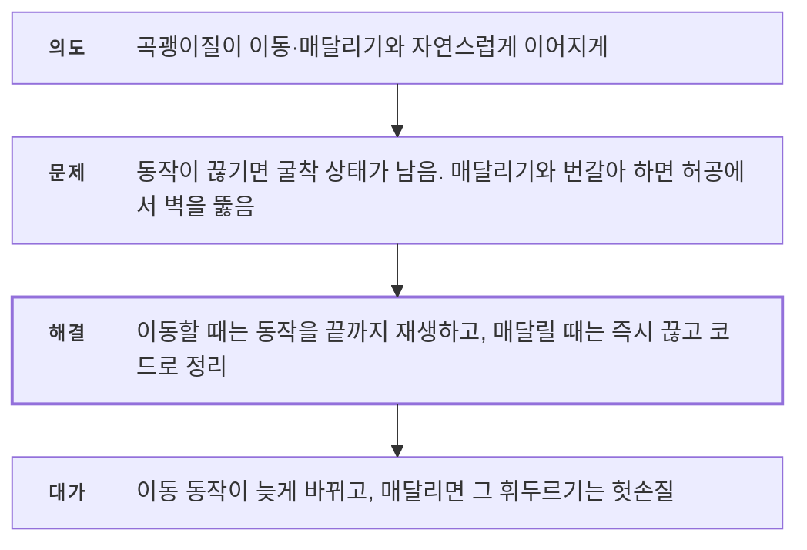
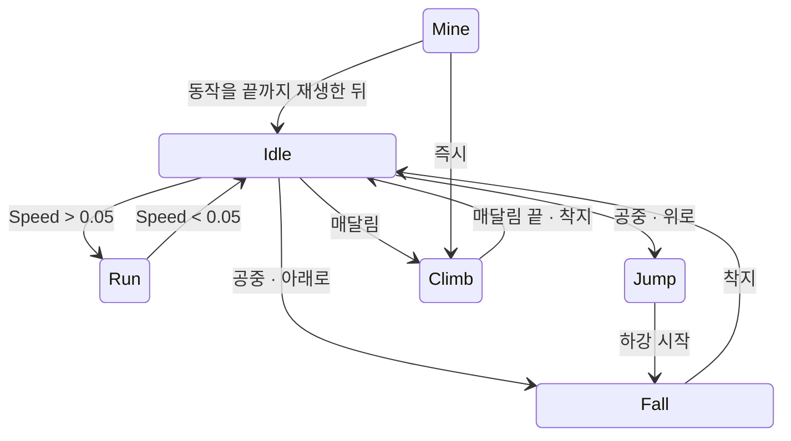
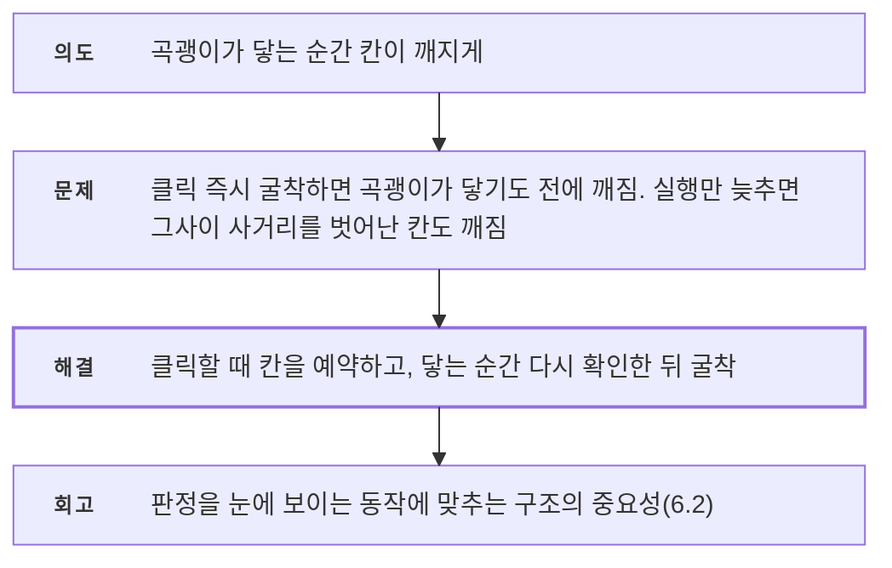
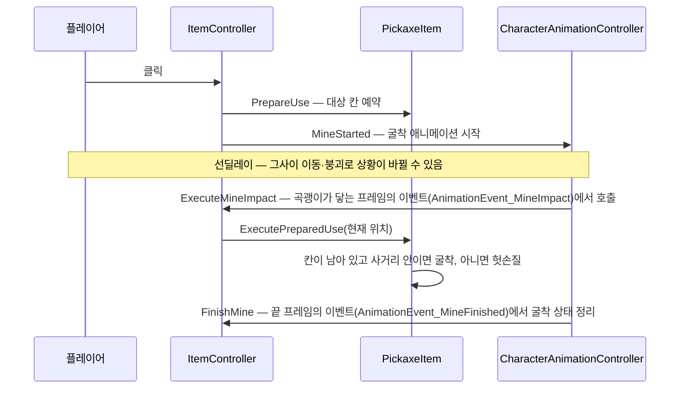
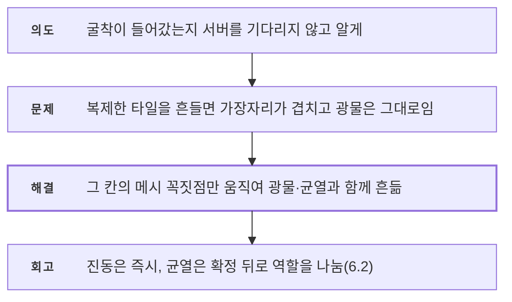
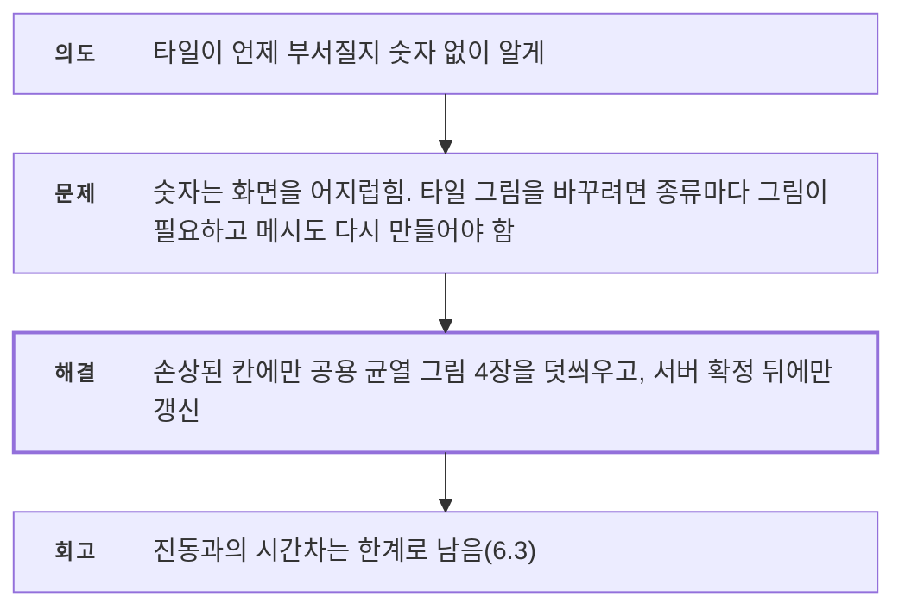

# Folk Sack — 굴착 판정과 피드백을 구현하고 팀을 이끈 2D 멀티플레이 채굴 게임

> 최대 4명이 한 광산을 파 내려가 캔 광물을 팔아 번 골드로 겨루는 2D 사이드뷰 멀티플레이 채굴 게임입니다. 팀 프로젝트 발표에서 참가 5팀 투표로 '가장 좋은 경험을 준 게임' 부문에 선정되었습니다.

개발 형태: 3인 팀 프로젝트 · 팀장

| 항목 | 내용 |
|---|---|
| 장르 | 2D 사이드뷰 경쟁형 멀티플레이 채굴 (개인전 2~4인) |
| 기간 | 2026.08.14 ~ 09.18 (약 1개월) |
| 인원 | 3인 (채경희 · 주현진 · 박수하) |
| 내 역할 | 팀장(기획·일정 관리·검증) · 프로그래밍(굴착 2단계 판정·캐릭터 애니메이션 연동·균열 오버레이·타일 진동) · 그래픽·UI · 사운드 QA |
| 개발 환경 | Unity 6000.3.15f1 · C# · URP · DOTween · Cinemachine · Input System · Asana |
| 링크 | [GitHub](https://github.com/ashadeveloperr/3rd-TeamProject-KH) · [시연 영상](https://youtu.be/e2lY36N8coE) |

이 문서는 게임과 팀을 소개한 뒤(1장) 팀장으로서 기획하고 팀을 이끈 과정(2·3장)을 설명합니다. 이어서 제가 구현한 굴착(4장)과 사운드 QA(5장)를 다루고 결과와 회고(6장)로 마무리합니다.

## 1. 프로젝트 개요

### 1.1 컨셉


Folk Sack은 최대 4명이 한 광산을 함께 파 내려가며 광물을 모으는 2D 사이드뷰 경쟁형 멀티플레이 채굴 게임입니다. 플레이어는 지상 거래소에서 출발해 땅을 팝니다. 캔 자원은 지상으로 돌아오면 자동으로 팔리고 번 골드로 장비를 삽니다.

**코어 루프**


```mermaid
flowchart LR
  %% simple — 작은 설명 도표: 상세 문서에서 원문·크게 보기 줄을 숨김
  A["지상 거래소 출발"] --> B["굴착"] --> C["자원 획득"] --> D["귀환 판단"] --> E["지상 진입 시<br/>자동 판매"] --> F["장비 구매"]
```

목표 골드에 가장 먼저 도달한 플레이어가 그 자리에서 승리합니다. 아무도 도달하지 못한 채 제한 시간이 끝나면 골드를 가장 많이 모은 플레이어가 승리합니다(동점이면 모두 승리).

목표한 경험은 **"한 번 더 파 내려갈까, 지금 올라갈까"**를 계속 고민하는 재미입니다. 깊이 내려갈수록 비싼 광물이 나오지만 인벤토리에 담을 수 있는 무게에는 한도가 있습니다. 판매하기 전에 죽으면 가진 아이템 전부와 골드 절반을 그 자리에 떨어뜨리고, 다른 플레이어가 그것을 주워 갈 수 있습니다. 아래로 갈수록 위험도 커집니다. 지형이 무너져 떨어지고 무너진 흙에 묻히기도 하며, 다른 플레이어가 던진 다이너마이트나 숨겨 둔 지뢰가 기다립니다. 가방이 무거워질수록 "조금만 더"와 "이제 돌아가자" 사이의 긴장이 커지고, 이 판단이 승패를 가릅니다.

기획은 "2D 액션 플랫포머에서 지형이 상호작용으로 무너지며 플레이에 영향을 준다면 어떨까?"라는 구상에서 출발했습니다. 그래서 붕괴에 휘말리지 않으려면 갱도를 설계하며 파 내려가야 하는 게임을 만들고자 했습니다. 이 의도에 맞지 않는 플레이는 규칙으로 막았습니다. 허공에 뜬 채 벽이나 천장을 뚫고 올라가는 플레이가 그 예입니다(4.1).

### 1.2 팀 구성과 역할

세 사람이 약 한 달 동안 멀티플레이 게임 하나를 만들었습니다. 두 팀원이 게임의 큰 축을 하나씩 맡았고, 저는 팀장으로서 기획과 일정·검증을 맡으며 굴착과 그래픽을 만들었습니다.

| 팀원 | 맡은 분야 |
|---|---|
| 주현진 | 지형 생성·데이터·내구도, 지형 붕괴·낙하 지형·매몰, 서버가 확정한 변경을 모든 플레이어에게 맞추는 동기화(지형·아이템·상점·피해와 리스폰), 인벤토리 무게, 시야·미니맵, 로비와 플레이어 고유 색상, 원격 플레이어 애니메이션 동기화 |
| 박수하 | 캐릭터 이동(벽 매달리기·회피 기동), 곡괭이로 칠 칸 고르기와 조준 표시, 사용 아이템(다이너마이트·지뢰·횃불·디텍터), 상점 기능, 사망·리스폰 처리 |
| 채경희 (본인, 팀장) | 기획(초기 기획안), 일정 관리·검증, 굴착 판정, 캐릭터 애니메이션 연결, 타일 진동·균열 표시, 그래픽·UI, 사운드 QA |


그래픽도 제가 맡았습니다. 캐릭터는 craftpix.net의 무료 스프라이트 시트를 바탕으로 고쳤고 자원·아이템·광물과 균열 그림은 직접 도트로 그렸습니다. HUD·상점·결과창·메인·로비 UI도 직접 디자인해 적용했습니다.

### 1.3 내 파트의 구조

제 프로그래밍 작업은 모두 **굴착 한 번**에 모여 있습니다. 플레이어가 클릭한 뒤 타일에 금이 가기까지 굴착은 세 사람이 만든 단계를 차례로 지납니다. 아래 그림에서 굵은 테두리가 제가 만든 단계입니다.


```mermaid
flowchart TB
  %% simple — 작은 설명 도표: 상세 문서에서 원문·크게 보기 줄을 숨김
  A["클릭"] --> B["곡괭이 휘두르기<br/>채경희"]
  A --> C["칠 칸 고르기<br/>박수하"]
  B --> D["닿는 순간 판정<br/>채경희"]
  C --> D
  D --> E["서버에 굴착 요청<br/>주현진"]
  E --> F["타일 진동·굴착음<br/>채경희"]
  E --> G["서버가 확정한 지형 반영<br/>주현진"]
  G --> H["균열 표시<br/>채경희"]
  classDef key stroke-width:2px
  class B,D,F,H key
```

클릭하면 곡괭이를 휘두르는 동작이 시작되고 동시에 칠 칸이 정해집니다. 곡괭이가 타일에 닿는 순간 제가 만든 판정이 그 칸을 다시 확인하고 굴착을 실행합니다. 지형을 바꾸는 권한은 서버에만 있어서 클라이언트는 굴착을 요청만 하고, 지형은 서버가 확정한 결과로만 바뀝니다. 그래서 결과를 보여 주는 길도 둘로 나눴습니다. 요청을 보내는 즉시 타일이 흔들려 굴착이 들어갔음을 알리고, 타일이 얼마나 부서졌는지는 서버가 확정한 뒤 균열로 보여 줍니다.

굴착에서 세운 목표는 세 가지였습니다.

- 칸이 깨지는 순간을 곡괭이가 닿는 동작에 맞추고, 휘두르는 사이 상황이 바뀌어도 잘못 굴착되지 않게 하기(4.1·4.2)
- 굴착이 들어갔는지는 서버를 기다리지 않고 바로 알 수 있게 하기(4.4.1)
- 타일이 언제 부서질지는 화면을 어지럽히지 않으면서 서버가 확정한 값으로 보여 주기(4.4.2)

## 2. 기획

첫 회의를 위해 제가 쓴 초기 기획안에서 출발해 만들고 플레이하면서 기획을 고쳐 나갔습니다.

### 2.1 초기 기획안

첫 팀 회의에서 게임 방향과 구현 범위를 합의하려고 초기 기획안을 썼습니다. 목표는 "최대 4명이 하나의 광산을 파고 내려가 광물과 보석을 모으고, 다른 플레이어를 간접적으로 방해하며 먼저 승리 조건을 달성하는 게임"이었고 핵심 재미를 네 가지로 정했습니다.

| 핵심 재미 | 내용 |
|---|---|
| 귀환 시점 판단 | 아래로 갈수록 비싼 광물, 인벤토리 무게 제한, 판매 전 사망 시 손실 → 더 캘지 돌아갈지 판단 |
| 금전의 소비·축적 판단 | 돈은 장비 구매와 승리 목표에 함께 쓰여, 장비를 사면 승리에서 멀어짐 |
| 직접 전투 없는 간접 PvP | 직접 공격 대신 다이너마이트·물·독가스·용암·설치물로 방해 |
| 시간에 따라 변하는 광산 | 장기전일수록 자연재해의 빈도와 강도가 커짐 |

코어 루프는 "안전지대 출발 → 탐사·굴착 → 자원 획득 → 귀환 판단 → 판매 → 장비 구매 또는 자금 보존 → 경쟁자 방해 → 승리 조건 달성"으로 잡았습니다. 구현 범위는 한 판의 최소 형태부터 정했습니다. **여러 플레이어가 같은 광산에서 굴착하고, 광물을 모아 지상에서 팔고, 정해진 승리 조건을 먼저 달성하면 끝나는 게임**을 먼저 완성한 뒤 경쟁 요소와 자연재해를 더하기로 했습니다.

### 2.2 만들면서 바꾼 기획

기획안의 뼈대인 귀환 시점 판단·간접 PvP·거래소 중심의 루프는 끝까지 유지했습니다. 승리 조건은 기획안의 두 후보(목표 금액 선착순, 제한 시간 내 최대 금액)를 하나로 합쳤습니다. 나머지는 만들고 플레이해 보면서 아래처럼 바꿨습니다.

| 초기 기획안 | 지금 게임 |
|---|---|
| 자연재해(용암·물·폭우)와 지형 붕괴 | 지형 붕괴·낙하 지형·매몰에 집중 |
| 드릴로 굴착 게이지를 채워 파괴 | 곡괭이로 치고, 손상은 균열로 표시 |
| 이동하려는 방향이 막히면 그 방향을 굴착 | 마우스로 조준한 칸을 굴착 |
| 방해 수단: 다이너마이트·물·독가스·설치 블록·용암·몬스터 | 다이너마이트·지뢰 |
| 사망 시 일부만 떨어지고 나머지는 소멸 | 가진 아이템 전부와 골드 절반을 떨어뜨림 |

**자연재해를 빼고 지형 붕괴에 집중했습니다.**

초기 기획안에서 자연재해와 지형 붕괴는 별개의 아이디어였습니다. 하지만 자연재해까지 만들기에는 콘텐츠 범위가 넓고 구현도 어려워 기한 안에 끝내기 어렵다고 판단했습니다. 그래서 지형 붕괴라는 핵심 메커니즘에 플레이 경험을 모았습니다. 이 판단은 6.2에서 돌아봅니다.

**드릴 게이지 대신 곡괭이와 균열로 바꿨습니다.**

처음에는 드릴로 굴착 게이지를 채워야 타일이 부서지게 하려 했습니다. 그런데 게이지가 찰 때까지 키를 계속 누르고 있어야 했고 드릴이 도는 모습도 잘 보이지 않아 수동적이고 정적으로 느껴졌습니다. 그래서 곡괭이를 한 번씩 휘둘러 치게 하고, 얼마나 부서졌는지는 게이지 대신 타일 위의 균열로 보여 주기로 했습니다(4.4.2).

**이동 방향 대신 마우스로 조준한 칸을 파게 했습니다.**

이동하려는 방향을 파는 방식은 키보드만으로 조작합니다. 사각 타일로 된 맵에서는 움직임까지 타일 단위로 묶여 게임의 속도감이 크게 떨어진다고 판단했습니다. 그래서 이동은 키보드로 하고 굴착은 마우스로 조준한 칸에 하도록 나눴습니다.

**방해 수단은 플레이로 확인한 두 가지만 남겼습니다.**

물·독가스·용암은 지형 모양을 따라 차오르거나 쏟아져 내리는 메커닉이 필요해 구현 비용이 너무 컸습니다. 반면 다이너마이트와 지뢰는 실제로 플레이해 보니 쓰임새가 많았습니다. 다이너마이트는 상대를 방해할 때뿐 아니라 지형을 부술 때도 자주 쓰였고, 지뢰는 상대의 동선을 예측하거나 막는 데 좋았습니다.

**사망 페널티는 다시 일어설 여지를 남겼습니다.**

일부만 떨어지고 나머지는 사라지는 기존 기획에서는 죽은 사람에게 남는 것이 없어 한 번의 죽음이 사실상 패배로 이어지는 경우가 많았습니다. 상대를 쓰러뜨려 빼앗을 수 있는 자원은 어느 정도 보장하면서도 죽은 사람이 다시 일어설 만큼은 남겨야 했습니다. 그 절충안이 지금의 "아이템 전부 + 골드 절반"입니다.

## 3. 팀장으로서 한 일

팀장으로서의 목표는 세 사람의 작업이 기간 안에 하나의 플레이 가능한 빌드로 합쳐지게 하는 것이었습니다. 일을 나누는 것부터 일정과 검증, 작업을 합치는 단계까지 차례로 설명합니다.

### 3.1 강점에 맞춘 역할 배치와 업무 균형

먼저 팀원마다 강점이 다르다는 것을 확인하고 그에 맞게 일을 맡겼습니다. 한 팀원은 맡은 문제 하나를 끝까지 파고들어 완성도를 높이는 집중력이 뛰어났습니다. 이 강점은 살리되 한 기능에 너무 오래 머물지 않도록 진행 상황을 함께 확인했고, 기능이 충분히 완성되면 다음 작업으로 넘어가도록 일정을 조율했습니다.

업무량의 균형도 계속 맞춰야 했습니다. 처음에는 빈틈을 제가 직접 메우려 했지만 오래가기 어렵다고 보고 여유 있는 팀원과 일을 나눴습니다. 그러자 이번에는 적극적으로 일을 맡아 주던 팀원에게 일이 몰렸습니다. 진행 상황을 보며 다른 팀원에게도 일을 나눠 균형을 다시 맞췄습니다.

### 3.2 일정과 검증 운영


일정과 작업은 Asana 보드로 관리했습니다. 보드에 이용 가이드와 완료 조건을 담은 카드 템플릿을 마련하고, 카드마다 팀원별 리뷰 칸을 두어 서로의 작업을 검증하게 했습니다. 버전별 일정과 검증 역할을 나눴고 멀티플레이 검증 환경이 갖춰지기 전까지 작업을 어떻게 나눌지도 규칙으로 정했습니다.

검증 담당도 제가 맡았습니다. 같은 위치 반복 굴착, 연쇄 붕괴, 매몰 → 지속 피해 → 탈출처럼 반복되거나 예외적인 상황 12가지를 직접 검증했습니다. 넓은 테스트 지형에서 프레임이 크게 떨어지는 성능 문제도 찾아 팀에 공유했습니다.


처음 계획한 일은 대부분 끝냈지만 진행하면서 새로 생긴 일이 처음 계획보다 많았습니다. 프로토타입(`[TP]`) 작업은 8/28을 목표로 두었고, 그 뒤 상점·인벤토리·무게·엔딩 같은 MVP 단계 작업(`[MVP]`·`[MVB]`)을 보드에 더했습니다. 새로 생긴 일 가운데는 UI·게임 진행(+11), 자원·아이템 획득 루프(+11), 지형 및 맵 시스템(+10)이 가장 많았습니다(영역별 전체는 위 그림). 범위를 좁힌 판단과 일정에서 배운 점은 6.2에서 돌아봅니다.

| 항목 (Asana 기록 기준) | 계획 (8/24 보드) | 실제 |
|---|---|---|
| 처음 계획한 작업 | 34개 | 30개 완료 (88%) |
| 진행 중 새로 생긴 작업 | — | 50개 |
| UI·게임 진행 작업 | 2개 | 13개 |
| 자원·아이템 획득 루프 작업 | 0개 | 11개 |
| MVP 단계 작업 (`[MVP]`·`[MVB]`) | — | 17개 추가 |

### 3.3 통합 단계의 씬 충돌과 프리팹 분리

프로젝트 중반부터 각자의 작업을 합치면서 충돌이 늘었습니다. 특히 제가 HUD 그래픽을 고치고 다른 팀원이 상점 UI 기능을 같은 씬에서 작업해 병합할 때마다 충돌이 반복됐습니다. Unity 씬 파일은 여러 사람이 동시에 고치면 충돌을 풀기 어렵습니다. 그래서 HUD와 상점 UI를 씬에서 꺼내 각각 별도 프리팹으로 나눴습니다. 팀 커밋이 가장 몰린 9/7~9/9(9/8 하루 49회, 저장소 기록) 사이의 일입니다. 그 뒤로는 같은 씬을 건드리지 않고 각자 맡은 프리팹만 고칠 수 있었습니다.

## 4. 굴착: 한 번의 곡괭이질이 화면에 닿기까지

1.3에서 본 굴착의 흐름을 이제 코드로 따라갑니다. 아래 표는 단계마다 맡은 클래스와 만든 사람입니다. 팀원이 만든 단계도 흐름을 이해하는 데 필요한 만큼 코드와 함께 싣고, 만든 사람은 이 표와 코드 제목에만 적었습니다.

| 단계 | 하는 일 | 주요 클래스 | 만든 사람 |
|---|---|---|---|
| 휘두르기 (4.1) | 클릭으로 굴착 동작을 시작하고 곡괭이가 닿는 프레임을 알림 | `ItemController` · `CharacterAnimationController` | 채경희 (좌우 반전 보정은 주현진) |
| 칸 고르기 (4.2.1) | 마우스 방향에서 칠 칸을 고르고 사거리를 확인 | `PickaxeItem.TryGetTargetCell` · `TryGetNearestTargetCell` | 박수하 |
| 판정 (4.2.2) | 클릭할 때 칸을 예약하고, 곡괭이가 닿는 순간 다시 확인해 실행 | `PickaxeItem.PrepareUse` · `ExecutePreparedUse` | 채경희 (지금의 재검사 기준은 박수하가 서버에 맞춰 고침) |
| 서버 요청 (4.3) | 굴착 요청을 서버로 보내고 확정을 기다림 | `PickaxeItem.ExecuteDigPower` · `RoomClient.RequestExcavation` | 주현진 |
| 서버 확정 반영 (4.3) | 서버가 보낸 변경 묶음(Batch)을 순서대로 지형 데이터와 메시에 반영 | `RoomClient` · `TerrainManager` · `TerrainGridWorld.ApplyAuthoritativeBatch` | 주현진 |
| 피드백 (4.4) | 요청 즉시 타일 진동·굴착음, 서버 확정 뒤 균열 | `TerrainTileHitEffect` · `TerrainCrackOverlayManager` | 채경희 |


```mermaid
flowchart LR
  IC["ItemController"] -->|"MineStarted 이벤트"| CAC["CharacterAnimationController"]
  CAC -->|"ExecuteMineImpact (타격 프레임)"| IC
  IC -->|"PrepareUse · ExecutePreparedUse"| PI["PickaxeItem"]
  PI -->|"RequestExcavation"| RC["RoomClient"]
  RC -->|"굴착 요청"| SV["서버"]
  SV -->|"지형 변경 Batch"| RC
  PI -->|"PlayTileHit"| TM["TerrainManager"]
  RC -->|"ApplyAuthoritativeBatch"| TM
  TM -->|"Play Dig"| GS["GameSound"]
  TM -->|"ApplyAuthoritativeBatch"| TGW["TerrainGridWorld"]
  TM -->|"PlayCellHit"| TGW
  TGW -->|"Play"| THE["TerrainTileHitEffect"]
  TGW -->|"RefreshCell"| TCO["TerrainCrackOverlayManager"]
```

- `RoomClient` : 서버와 WebSocket으로 연결해 굴착을 요청하고, 서버가 확정한 지형 변경을 받습니다.
- `TerrainManager` : 지형 데이터의 기준을 들고 요청과 적용을 받는 창구입니다.
- `TerrainGridWorld` : 지형 데이터를 청크 메시와 외곽 Collider로 그립니다.
- `GameSound` : 효과음을 재생합니다(5장).

1.3에서 말한 결과를 보여 주는 두 길은 그림에서 `PickaxeItem`이 요청을 보낸 뒤 갈라지는 두 화살표입니다. `PlayTileHit` 쪽은 요청 즉시 진동과 소리를 내고, `ApplyAuthoritativeBatch` 쪽은 서버가 확정한 뒤 지형과 균열을 바꿉니다.

### 4.1 휘두르기: 굴착 동작을 끊을지 말지를 경로마다 정한다


```mermaid
---
config:
  layout: elk
  flowchart:
    wrappingWidth: 520
    padding: 12
---
flowchart TB
  %% feature-flow — _local/flow-diagrams.py가 만듦
  I["<div style='width:460px;display:flex;gap:14px;align-items:baseline;text-align:left;white-space:normal'><span style='flex:0 0 44px;padding-top:2px;font-size:12px;font-weight:700;letter-spacing:.12em;color:var(--accent-ink)'>의도</span><span style='flex:1;font-size:15px;line-height:1.55;color:var(--ink)'>곡괭이질이 이동·매달리기와 자연스럽게 이어지게</span></div>"]
  P["<div style='width:460px;display:flex;gap:14px;align-items:baseline;text-align:left;white-space:normal'><span style='flex:0 0 44px;padding-top:2px;font-size:12px;font-weight:700;letter-spacing:.12em;color:var(--accent-ink)'>문제</span><span style='flex:1;font-size:15px;line-height:1.55;color:var(--ink)'>동작이 끊기면 굴착 상태가 남음. 매달리기와 번갈아 하면 허공에서 벽을 뚫음</span></div>"]
  S["<div style='width:460px;display:flex;gap:14px;align-items:baseline;text-align:left;white-space:normal'><span style='flex:0 0 44px;padding-top:2px;font-size:12px;font-weight:700;letter-spacing:.12em;color:var(--accent-ink)'>해결</span><span style='flex:1;font-size:15px;line-height:1.55;color:var(--ink)'>이동할 때는 동작을 끝까지 재생하고, 매달릴 때는 즉시 끊고 코드로 정리</span></div>"]
  R["<div style='width:460px;display:flex;gap:14px;align-items:baseline;text-align:left;white-space:normal'><span style='flex:0 0 44px;padding-top:2px;font-size:12px;font-weight:700;letter-spacing:.12em;color:var(--accent-ink)'>대가</span><span style='flex:1;font-size:15px;line-height:1.55;color:var(--ink)'>이동 동작이 늦게 바뀌고, 매달리면 그 휘두르기는 헛손질</span></div>"]
  I --> P --> S --> R
  classDef key stroke-width:2px
  class S key
```


굴착은 캐릭터가 곡괭이를 휘두르는 동작에서 시작합니다. 저는 캐릭터 스프라이트와 애니메이션을 세팅하고 이동·점프·낙하·벽 매달리기·굴착·사망 상태를 Animator에 연결했습니다. 상태 규칙은 직접 정했고 연결 코드는 AI의 도움을 받아 구현했습니다.

문제는 굴착 동작이 다른 상태로 넘어갈 때 생겼습니다.

1. 굴착 상태는 동작의 마지막 프레임에 걸린 이벤트(`AnimationEvent_MineFinished`)가 정리합니다. 동작이 중간에 끊기면 이 이벤트가 오지 않아 굴착 상태가 그대로 남습니다.
2. 공중에서 굴착과 매달리기를 빠르게 번갈아 하면 허공에 뜬 채 벽이나 천장을 뚫고 올라갈 수 있었습니다.

그래서 동작이 끊기는 경로마다 처리를 다르게 정했습니다.

| | 이동·점프·낙하로 넘어갈 때 | 벽에 매달릴 때 |
|---|---|---|
| 선택 | 동작을 끝까지 재생(Exit Time) | 즉시 끊고 코드가 굴착 상태를 정리 |
| 이유 | 중간에 끊으면 타격·정리 이벤트가 실행되지 않음. 동작이 끊기는 모습도 어색함 | 허공에서 벽·천장을 뚫는 플레이는 갱도를 설계하며 파 내려가는 기획 의도와 맞지 않음 |
| 대가 | 굴착 중 이동을 시작해도 동작이 끝나야 이동 동작으로 바뀜 | 매달리면 휘두르던 굴착은 헛손질로 끝남 |

이동으로 넘어가는 경로는 끝까지 재생해 판정과 보이는 품질을 지키고, 매달리는 경로는 즉시 끊어 기획 의도를 지켰습니다.


```mermaid
stateDiagram-v2
  %% 격자: - Mine - | Climb Idle Run | - Jump - | - Fall -
  %% 격자 열 간격: 130
  %% 화살표 Idle -> Fall: 나감=아래 들어감=위 자리=왼쪽
  %% 화살표 Fall -> Idle: 나감=위 들어감=아래 자리=오른쪽
  %% 화살표 Mine -> Climb: 나감=왼쪽 들어감=위
  state "<div style=width:200px>Idle</div>" as Idle
  state "<div style=width:200px>Fall</div>" as Fall
  Idle --> Run: Speed > 0.05
  Run --> Idle: Speed < 0.05
  Idle --> Jump: 공중 · 위로
  Idle --> Fall: 공중 · 아래로
  Jump --> Fall: 하강 시작
  Fall --> Idle: 착지
  Idle --> Climb: 매달림
  Climb --> Idle: 매달림 끝 · 착지
  Mine --> Idle: 동작을 끝까지 재생한 뒤
  Mine --> Climb: 즉시
```

그림에는 주요 전이만 그렸습니다. Run·Jump·Fall도 Idle과 같은 조건으로 서로 이어집니다. 굴착(Mine)은 `Mine` 트리거가 켜지면 어느 상태에서든 들어갈 수 있지만(Any State) 매달려 있거나 죽었을 때는 들어가지 않습니다.

- `CharacterAnimationController` : 매 프레임 플레이어의 속도·착지·매달림·사망 상태를 Animator 파라미터로 옮기고, 매몰되면 그림의 정렬 순서를 바꿉니다. 그림은 `Visual` 자식 오브젝트에 있습니다. 방향을 바꿀 때는 몸통 `BoxCollider2D`가 있는 루트 대신 이 자식만 뒤집고 위치를 몸통 Collider 중심에 맞게 보정합니다.
- `Char.controller`(Animator Controller 에셋) : 상태 7개(Idle·Run·Jump·Fall·Climb·Mine·Dead)
- `Mine.anim`(0.5초) : 곡괭이가 타일에 닿는 0.333초에 `AnimationEvent_MineImpact`(굴착 실행, 4.2), 동작이 끝나는 0.5초에 `AnimationEvent_MineFinished`(굴착 상태 정리)를 둡니다.
- `ItemController` : 굴착 중인지(`isMining`)를 들고 있습니다. 좌클릭을 누르고 있으면 동작이 끝날 때마다 다음 굴착을 시작합니다.

`CharacterAnimationController.cs` 111~128행

```csharp
if (itemController == null ||
    !itemController.IsMining)
{
    UpdateFacingDirection(velocity.x);
}

UpdateSortingOrder();

bool isClimbing = playerController.IsClimbing;

animator.SetBool(
    ClimbingHash,
    isClimbing);

if (isClimbing)
{
    animator.ResetTrigger(MineHash);
}
```

- 굴착 중에는 이동해도 바라보는 방향을 바꾸지 않습니다. 그래서 곡괭이가 클릭할 때 정한 칸(4.2) 쪽을 계속 향합니다.
- 매몰되면 정렬 순서를 2에서 -1로 낮춰 캐릭터를 지형 뒤에 그립니다(`UpdateSortingOrder`).
- 매달리면 남아 있던 굴착 트리거를 지웁니다. 매달리기가 끝나자마자 굴착 동작이 튀어나오지 않게 하기 위해서입니다.
- (발췌 밖) 매달려 움직일 때만 Climb 동작을 재생합니다. 매달린 채 멈춰 있으면 Animator 파라미터 `ClimbAnimSpeed`를 0으로 해 동작도 멈춥니다.
- `ItemController`(팀원과 함께 쓴 파일이라 코드는 싣지 않음) : 매달리는 순간 진행 중이던 굴착을 취소하고 대상 칸 표시를 지웁니다. 매달린 동안에는 새 굴착을 시작하지 않고, 타격 이벤트가 어떤 이유로 오더라도 매달려 있으면 굴착하지 않습니다.

### 4.2 판정: 칸을 고르고 곡괭이가 닿는 순간 다시 확인한다


```mermaid
---
config:
  layout: elk
  flowchart:
    wrappingWidth: 520
    padding: 12
---
flowchart TB
  %% feature-flow — _local/flow-diagrams.py가 만듦
  I["<div style='width:460px;display:flex;gap:14px;align-items:baseline;text-align:left;white-space:normal'><span style='flex:0 0 44px;padding-top:2px;font-size:12px;font-weight:700;letter-spacing:.12em;color:var(--accent-ink)'>의도</span><span style='flex:1;font-size:15px;line-height:1.55;color:var(--ink)'>곡괭이가 닿는 순간 칸이 깨지게</span></div>"]
  P["<div style='width:460px;display:flex;gap:14px;align-items:baseline;text-align:left;white-space:normal'><span style='flex:0 0 44px;padding-top:2px;font-size:12px;font-weight:700;letter-spacing:.12em;color:var(--accent-ink)'>문제</span><span style='flex:1;font-size:15px;line-height:1.55;color:var(--ink)'>클릭 즉시 굴착하면 곡괭이가 닿기도 전에 깨짐. 실행만 늦추면 그사이 사거리를 벗어난 칸도 깨짐</span></div>"]
  S["<div style='width:460px;display:flex;gap:14px;align-items:baseline;text-align:left;white-space:normal'><span style='flex:0 0 44px;padding-top:2px;font-size:12px;font-weight:700;letter-spacing:.12em;color:var(--accent-ink)'>해결</span><span style='flex:1;font-size:15px;line-height:1.55;color:var(--ink)'>클릭할 때 칸을 예약하고, 닿는 순간 다시 확인한 뒤 굴착</span></div>"]
  R["<div style='width:460px;display:flex;gap:14px;align-items:baseline;text-align:left;white-space:normal'><span style='flex:0 0 44px;padding-top:2px;font-size:12px;font-weight:700;letter-spacing:.12em;color:var(--accent-ink)'>회고</span><span style='flex:1;font-size:15px;line-height:1.55;color:var(--ink)'>판정을 눈에 보이는 동작에 맞추는 구조의 중요성(6.2)</span></div>"]
  I --> P --> S --> R
  classDef key stroke-width:2px
  class S key
```


처음 구현(`Use()`)은 클릭하는 순간 칠 칸을 고르고 바로 굴착했습니다. 그런데 곡괭이 애니메이션을 붙이자 곡괭이가 닿기도 전에 칸이 먼저 깨졌습니다. 그렇다고 굴착을 곡괭이가 닿는 프레임으로 미루기만 하면 다른 문제가 생깁니다. 곡괭이를 들어 올리는 사이 플레이어가 달려가 칸이 사거리를 벗어날 수 있고, 다른 플레이어나 붕괴 때문에 칸이 사라질 수도 있습니다. 그래도 굴착은 그대로 실행됩니다.

| | 대안 A. 클릭 즉시 굴착 (처음 구현) | **대안 B. 예약·실행 2단계 판정 (선택)** |
|---|---|---|
| 방식 | 클릭하는 순간 칸을 정하고 바로 굴착 | 클릭할 때 칸을 예약하고(`PrepareUse`), 곡괭이가 닿는 프레임에 다시 확인한 뒤 실행(`ExecutePreparedUse`) |
| 장점 | 칸 고르기와 굴착이 한 번에 끝나 예약 상태를 둘 필요가 없음 | 칸이 깨지는 시점이 곡괭이가 닿는 프레임과 맞음. 그사이 사거리를 벗어나거나 사라진 칸은 굴착하지 않음 |
| 단점 | 곡괭이가 닿기 전에 칸이 깨져 동작과 결과가 어긋남 | 예약한 칸을 따로 관리해야 함. 실행 순간 칸이 무효면 그 휘두르기는 헛손질 |

그래서 칠 칸을 **예약하는 단계(클릭)**와 굴착을 **실행하는 단계(곡괭이가 닿는 프레임)**로 나눈 2단계 판정을 직접 설계하고 구현했습니다. 실행 단계는 4.1에서 곡괭이가 닿는 프레임에 걸어 둔 이벤트가 부릅니다.


```mermaid
sequenceDiagram
  participant P as 플레이어
  participant IC as ItemController
  participant PI as PickaxeItem
  participant CAC as CharacterAnimationController
  P->>IC: 클릭
  IC->>PI: PrepareUse — 대상 칸 예약
  IC->>CAC: MineStarted — 굴착 애니메이션 시작
  Note over P,CAC: 선딜레이 — 그사이 이동·붕괴로 상황이 바뀔 수 있음
  CAC->>IC: ExecuteMineImpact — 곡괭이가 닿는 프레임의 이벤트(AnimationEvent_MineImpact)에서 호출
  IC->>PI: ExecutePreparedUse(현재 위치)
  PI->>PI: 칸이 남아 있고 사거리 안이면 굴착, 아니면 헛손질
  CAC->>IC: FinishMine — 끝 프레임의 이벤트(AnimationEvent_MineFinished)에서 굴착 상태 정리
```

#### 4.2.1 칠 칸 고르기

클릭할 때 예약하는 칸은 `TryGetTargetCell`이 고릅니다. 플레이어가 지형 안에 묻혀 있으면 서 있는 칸을 고릅니다. 그렇지 않으면 `TryGetNearestTargetCell`이 플레이어 칸에서 클릭한 칸까지 격자 위로 직선을 그어 처음 만나는 지형을 찾습니다. 캘 수 없는 타일은 시선을 막을 뿐 대상이 되지 않습니다. 대각선으로 지나갈 때 양옆이 모두 막혀 있으면 그 틈은 지나가지 못하고 막고 있는 타일이 대상이 됩니다. 마지막으로 칸 중심과 플레이어 사이의 거리가 곡괭이 사거리 안인지 확인합니다. 조준선과 대상 칸 하이라이트도 이 규칙으로 고른 칸을 표시합니다.

`PickaxeItem.cs` 184~202행 (박수하 작성, 발췌)

```csharp
private bool TryGetNearestTargetCell(TerrainManager manager, Vector2Int start, Vector2Int end, out Vector2Int snappedCell)
{
    snappedCell = start;
    int x0 = start.x, y0 = start.y, x1 = end.x, y1 = end.y;
    int dx = Mathf.Abs(x1 - x0), dy = Mathf.Abs(y1 - y0);
    int sx = x0 < x1 ? 1 : -1, sy = y0 < y1 ? 1 : -1;
    int err = dx - dy, currX = x0, currY = y0;

    while (true)
    {
        Vector2Int currentCell = new Vector2Int(currX, currY);
        if (currentCell != start && manager.HasTerrain(currentCell))
        {
            // 채굴 불가 타일은 시야를 막지만 타깃으로 선택하지 않음
            if (manager.IsCellMineable(currentCell) == false) return false;

            snappedCell = currentCell;
            return true;
        }
// (중략: 끝 칸 도달 검사, 대각선 이동 시 양옆이 막혔는지 검사)
```

#### 4.2.2 곡괭이가 닿는 순간 다시 확인하기

곡괭이가 닿는 프레임에는 예약해 둔 칸이 아직 유효한지 다시 확인하고 굴착을 실행합니다.

`PickaxeItem.cs` 224~279행 (처음 작성한 판, 재검사 기준은 뒤에 바뀜)

```csharp
public void ExecutePreparedUse(Vector3 currentOwnerPos)
{
    if (!hasPendingDig ||
        pendingTerrainManager == null)
    {
        return;
    }

    hasPendingDig = false;

    if (!IsPreparedTargetStillValid(currentOwnerPos))
    {
        pendingTerrainManager = null;
        return;
    }

    ExecuteDigPower(
        pendingTerrainManager,
        pendingTargetCell,
        Def.PickaxeData.Value.DigPower);

    pendingTerrainManager = null;
}

private bool IsPreparedTargetStillValid(Vector3 currentOwnerPos)
{
// (중략)
    if (!pendingTerrainManager.HasTerrain(pendingTargetCell))
        return false;
// (중략)
    Bounds targetBounds = new Bounds(
        targetWorldPos,
        new Vector3(cellSize, cellSize, 0f));

    Vector3 closestPoint =
        targetBounds.ClosestPoint(currentOwnerPos);

    float distance =
        Vector2.Distance(currentOwnerPos, closestPoint);

    return distance <= Def.PickaxeData.Value.Range;
}
```

- 검사보다 먼저 `hasPendingDig`를 끕니다. 그래서 칸이 무효여도 한 번 휘두르면 판정은 한 번만 일어납니다.
- 예약한 칸에 지형이 남아 있는지(`HasTerrain`) 다시 봅니다. 사거리는 클릭할 때가 아니라 곡괭이가 닿는 순간의 위치(`currentOwnerPos`)에서 칸 경계의 가장 가까운 점(`Bounds.ClosestPoint`)까지 잽니다. 하나라도 어긋나면 그 휘두르기는 헛손질입니다.

서버 판정이 붙은 뒤에는 재검사 기준을 서버와 맞췄습니다. 지금의 `IsPreparedTargetStillValid`는 서버와 똑같이 칸 중심과 지금 플레이어 위치 사이의 거리만 비교합니다. 칸을 아직 캘 수 있는지는 다음 단계인 서버 요청에서 다시 확인되기 때문입니다. 클릭할 때 예약하고 곡괭이가 닿는 순간 실행하는 2단계 구조는 그대로입니다.

그 결과 칸이 깨지는 시점이 클릭이 아니라 곡괭이가 닿는 프레임이 되어 동작과 결과가 맞게 되었습니다. 휘두르는 사이 사거리를 벗어난 칸은 굴착되지 않고 헛손질로 끝납니다.

### 4.3 서버 확정: 지형은 서버가 정하고 모든 클라이언트가 같은 순서로 반영한다

판정을 통과한 굴착은 여기서부터 서버를 거칩니다. 여러 플레이어가 한 광산을 함께 파기 때문에 지형을 바꾸는 권한은 서버에만 있습니다. 클라이언트는 굴착을 요청만 하고 실제 지형은 서버가 보낸 결과를 받아서만 바꿉니다.

`PickaxeItem.cs` 154~161행 (주현진 작성, `RequestExcavation`이 성공하면 `PlayTileHit`을 부르는 두 줄은 채경희)

```csharp
RoomClient roomClient = RoomClient.Instance;
if (roomClient != null && roomClient.IsAuthoritativeTerrainMode)
{
    // 로컬 지형 변경은 서버의 terrain_batch를 받은 경우에만 적용한다.
    if (roomClient.RequestExcavation(cell, Def.ID))
        manager.PlayTileHit(cell);
    return;
}
```

4.2.2의 `ExecutePreparedUse`가 부르는 `ExecuteDigPower`는 서버 모드에서 지형을 직접 바꾸지 않고 `RoomClient.RequestExcavation`으로 요청만 보냅니다. 요청이 전송되면 그 자리에서 `PlayTileHit`으로 진동과 굴착음을 냅니다. 타일 진동(4.4.1)이 서버 흐름에 들어가는 곳이 바로 이 두 줄입니다. `RequestExcavation`은 WebSocket으로 칸 좌표와 곡괭이 ID를 보냅니다. 같은 칸은 서버가 확정하기 전까지 다시 보내지 않고, 확정을 기다리는 요청이 너무 많으면 더 보내지 않습니다. 서버 프로그램은 이 저장소 밖에 있어 여기서는 클라이언트 쪽만 설명합니다.

서버가 확정한 변경은 묶음(Batch)으로 돌아옵니다. 묶음마다 어느 지형 판(Revision)에서 출발해 어느 판이 되는지가 적혀 있습니다. 그래서 순서가 뒤바뀌어 도착해도 클라이언트는 앞 판이 올 때까지 기다렸다가 차례대로 적용합니다.

`RoomClient.cs` 1437~1447행 (주현진 작성)

```csharp
if (batch.BaseRevision > localRevision)
{
    // 현재 Batch보다 앞선 Revision이 아직 도착하지 않았다. 다음 수신/적용 후
    // DrainBufferedTerrainBatches에서 자연스럽게 적용된다.
    bufferedTerrainBatches[batch.BaseRevision] = message;
    Debug.LogWarning(
        $"[RoomClient] Terrain batch buffered: local={localRevision}, " +
        $"required={batch.BaseRevision}, result={batch.ResultRevision}",
        this);
    return;
}
```

차례가 된 묶음은 `TerrainManager.ApplyAuthoritativeBatch`를 거쳐 `TerrainGridWorld`에 반영됩니다. 굴착뿐 아니라 붕괴로 떨어지는 지형과 다이너마이트 폭발도 같은 길로 들어옵니다.

`TerrainGridWorld.cs` 220~242행 (주현진 작성, `RefreshCellFeedback` 호출 줄은 채경희)

```csharp
/// <summary>서버 확정 변경만 이 API로 일괄 반영한다.</summary>
public bool ApplyAuthoritativeBatch(TerrainChangeBatch batch, out string error)
{
// (중략: 데이터 초기화 확인)
    if (data.TryApplyAuthoritativeBatch(batch, out error) == false) return false;

    foreach (TerrainCellChange change in batch.Changes)
    {
        MarkCellDirty(change.Coord);
        resourceViewManager.RefreshCell(this, change.Coord);
        RefreshCellFeedback(change.Coord);
// (중략: 에디터 전용 내구도 표시)
    }

    return true;
}
```

바뀐 칸마다 지형 데이터(내구도·타일 종류)가 갱신됩니다. 그 칸이 속한 청크는 다시 그릴 대상으로 표시되어 프레임 끝(`LateUpdate`)에 메시가 새로 만들어지고 광물 표시도 새로 고쳐집니다. 마지막 줄의 `RefreshCellFeedback`은 그 칸의 균열을 갱신합니다. 균열이 서버가 확정한 뒤에만 바뀌는 것은 이 길 위에서만 그려지도록 연결했기 때문입니다(4.4.2).

### 4.4 피드백: 진동은 바로, 균열은 서버 확정 뒤

판정이 끝나면 플레이어에게 결과를 보여 줘야 합니다. 타일마다 내구도가 달라 곡괭이질만으로는 언제 부서질지 알 수 없는데, 붕괴와 매몰이 있는 게임에서 이 정보는 꼭 필요합니다. 그렇다고 서버가 확정할 때까지 기다리게 할 수도 없었습니다. 플레이어는 원하는 칸에 굴착이 들어갔는지 바로 알고 싶어 하기 때문입니다. 그래서 요청과 동시에 타일이 흔들리고(4.4.1) 서버가 확정한 뒤 균열이 생기도록(4.4.2) 피드백을 둘로 나눴습니다. 두 피드백 모두 무엇을 어떻게 보여 줄지 제가 설계했고, AI가 구현한 것을 직접 플레이하며 원하는 느낌이 날 때까지 조정했습니다.

#### 4.4.1 타일 진동: 친 칸이 바로 흔들려 굴착이 들어갔음을 알린다


```mermaid
---
config:
  layout: elk
  flowchart:
    wrappingWidth: 520
    padding: 12
---
flowchart TB
  %% feature-flow — _local/flow-diagrams.py가 만듦
  I["<div style='width:460px;display:flex;gap:14px;align-items:baseline;text-align:left;white-space:normal'><span style='flex:0 0 44px;padding-top:2px;font-size:12px;font-weight:700;letter-spacing:.12em;color:var(--accent-ink)'>의도</span><span style='flex:1;font-size:15px;line-height:1.55;color:var(--ink)'>굴착이 들어갔는지 서버를 기다리지 않고 알게</span></div>"]
  P["<div style='width:460px;display:flex;gap:14px;align-items:baseline;text-align:left;white-space:normal'><span style='flex:0 0 44px;padding-top:2px;font-size:12px;font-weight:700;letter-spacing:.12em;color:var(--accent-ink)'>문제</span><span style='flex:1;font-size:15px;line-height:1.55;color:var(--ink)'>복제한 타일을 흔들면 가장자리가 겹치고 광물은 그대로임</span></div>"]
  S["<div style='width:460px;display:flex;gap:14px;align-items:baseline;text-align:left;white-space:normal'><span style='flex:0 0 44px;padding-top:2px;font-size:12px;font-weight:700;letter-spacing:.12em;color:var(--accent-ink)'>해결</span><span style='flex:1;font-size:15px;line-height:1.55;color:var(--ink)'>그 칸의 메시 꼭짓점만 움직여 광물·균열과 함께 흔듦</span></div>"]
  R["<div style='width:460px;display:flex;gap:14px;align-items:baseline;text-align:left;white-space:normal'><span style='flex:0 0 44px;padding-top:2px;font-size:12px;font-weight:700;letter-spacing:.12em;color:var(--accent-ink)'>회고</span><span style='flex:1;font-size:15px;line-height:1.55;color:var(--ink)'>진동은 즉시, 균열은 확정 뒤로 역할을 나눔(6.2)</span></div>"]
  I --> P --> S --> R
  classDef key stroke-width:2px
  class S key
```


처음에는 친 타일과 같은 그림을 위에 하나 더 만들어 흔들었습니다. 하지만 원본 타일이 뒤에 그대로 남아 가장자리가 겹쳐 보였습니다. 타일에 박힌 광물도 따라 흔들리지 않아 한 몸이라는 느낌이 깨졌습니다.

| | 대안 A. 복제본 흔들기 (첫 구현) | **대안 B. 지형 메시의 꼭짓점 이동 (선택)** |
|---|---|---|
| 방식 | 친 타일과 같은 그림을 위에 하나 더 만들어 흔듦 | 지형 메시에서 그 칸의 꼭짓점만 옮기고, 광물 표시와 균열에도 같은 이동량을 적용 |
| 장점 | 지형 메시 코드(`TerrainGridWorld`)를 고치지 않고 별도 오브젝트로 구현 | 타일 자체가 흔들리고 광물·균열도 함께 움직여 한 몸으로 보임 |
| 단점 | 원본 타일이 뒤에 남아 가장자리가 겹쳐 보임 · 광물이 따라 흔들리지 않음 | 팀원이 만든 지형 메시 코드에 칸별 꼭짓점 캐시와 이동량 관리를 더해야 함 |

그래서 복제본을 없애고 `TerrainGridWorld`에 칸별 꼭짓점 캐시와 화면용 이동량을 더해 타일 자체가 흔들리게 바꿨습니다. 진동은 서버 응답을 기다리지 않고 요청을 보내는 순간 재생합니다(서버 응답에서는 재생하지 않음).

- `TerrainTileHitEffect`가 지형 오브젝트에 붙어 칸마다 Tween을 `Dictionary<Vector2Int, Tween>`으로 관리합니다.
- 처음에는 효과를 곡괭이에 묶어 두어 한 칸을 치다가 다른 칸을 치면 앞 칸의 진동이 끊겼습니다. 칸마다 따로 재생하게 바꿔 다른 칸의 진동은 그대로 이어집니다.
- 이동량은 화면에만 쓰입니다. Collider·지형 데이터·스냅샷은 바꾸지 않아 흔들림이 물리 판정에 영향을 주지 않습니다.

`TerrainTileHitEffect.cs` 19~24 · 29~47행

```csharp
public void Play(TerrainGridWorld world, Vector2Int cell)
{
    if (isActiveAndEnabled == false || world == null || world.gameObject != gameObject ||
        world.IsOccupied(cell) == false) return;
    StopCell(cell);
    world.TrySetCellVisualOffset(cell, Vector3.zero);
// (중략)
        float strength = Mathf.Clamp(shakeStrength, 0f, 0.1f) * world.CellSize;
        Tween tween = DOTween.Shake(
                () => Vector3.zero,
                offset => world.TrySetCellVisualOffset(cell, offset),
                Mathf.Max(0.01f, shakeDuration),
                new Vector3(strength, strength, 0f),
                Mathf.Max(1, shakeVibrato),
                Mathf.Clamp(shakeRandomness, 0f, 180f))
            .SetTarget(this)
            .SetUpdate(true)
            .SetAutoKill(true)
            .SetRecyclable(false)
            .SetLink(gameObject, LinkBehaviour.KillOnDisable)
            .OnKill(() =>
            {
                activeShakes.Remove(cell);
                if (world != null) world.TrySetCellVisualOffset(cell, Vector3.zero);
            });
        activeShakes[cell] = tween;
```

- 같은 칸을 다시 치면 `StopCell`로 이전 Tween을 끝내고 이동량을 0으로 되돌린 뒤 새로 시작합니다. 그래서 흔들림이 쌓이지 않습니다.
- `DOTween.Shake`의 값을 오브젝트 위치가 아니라 `TrySetCellVisualOffset`(칸의 화면용 이동량, 아래)으로 넘깁니다.
- Tween이 끝나거나 비활성화로 끊겨도 `OnKill`에서 이동량을 0으로 되돌립니다.

`TerrainGridWorld.cs` 321~343행 (지형 렌더링 파일에 제가 추가한 부분)

```csharp
public bool TrySetCellVisualOffset(Vector2Int coord, Vector3 offset)
{
    offset.z = 0f;
    if (offset != Vector3.zero && IsOccupied(coord) == false) return false;
    if (offset == Vector3.zero)
    {
        offset = Vector3.zero;
        cellVisualOffsets.Remove(coord);
    }
    else cellVisualOffsets[coord] = offset;

    Vector2Int chunk = ToChunkCoord(coord);
    if (chunkVertexCaches.TryGetValue(chunk, out ChunkVertexCache cache) &&
        cache.CellVertices.TryGetValue(coord, out int vertex))
    {
        WriteCellVertices(cache.Vertices, vertex, coord - chunk * RenderChunkSize, offset);
        visualDirtyChunks.Add(chunk);
    }
    resourceViewManager?.RefreshPosition(this, coord);
    crackOverlayManager?.RefreshPosition(this, coord);
    return true;
}
```

- 칸이 속한 청크의 꼭짓점 캐시(`chunkVertexCaches`)에서 그 칸의 꼭짓점 4개만 이동량만큼 다시 씁니다(`WriteCellVertices`). 청크 메시 전체를 새로 만들지 않습니다.
- 바뀐 청크는 화면 갱신 목록(`visualDirtyChunks`)에만 넣고, 지형 데이터 변경 목록(`dirtyChunks`)과 Collider는 건드리지 않습니다. 서버가 확정한 변경이 들어오는 `MarkCellDirty`(4.3)와 일부러 길을 나눈 것입니다.
- 같은 이동량으로 광물 표시(`resourceViewManager`)와 균열(`crackOverlayManager`, 4.4.2)의 위치도 옮깁니다. 그래서 타일·광물·균열이 한 몸으로 흔들립니다.

#### 4.4.2 균열 오버레이: 숫자 없이 손상 정도를 보여 준다


```mermaid
---
config:
  layout: elk
  flowchart:
    wrappingWidth: 520
    padding: 12
---
flowchart TB
  %% feature-flow — _local/flow-diagrams.py가 만듦
  I["<div style='width:460px;display:flex;gap:14px;align-items:baseline;text-align:left;white-space:normal'><span style='flex:0 0 44px;padding-top:2px;font-size:12px;font-weight:700;letter-spacing:.12em;color:var(--accent-ink)'>의도</span><span style='flex:1;font-size:15px;line-height:1.55;color:var(--ink)'>타일이 언제 부서질지 숫자 없이 알게</span></div>"]
  P["<div style='width:460px;display:flex;gap:14px;align-items:baseline;text-align:left;white-space:normal'><span style='flex:0 0 44px;padding-top:2px;font-size:12px;font-weight:700;letter-spacing:.12em;color:var(--accent-ink)'>문제</span><span style='flex:1;font-size:15px;line-height:1.55;color:var(--ink)'>숫자는 화면을 어지럽힘. 타일 그림을 바꾸려면 종류마다 그림이 필요하고 메시도 다시 만들어야 함</span></div>"]
  S["<div style='width:460px;display:flex;gap:14px;align-items:baseline;text-align:left;white-space:normal'><span style='flex:0 0 44px;padding-top:2px;font-size:12px;font-weight:700;letter-spacing:.12em;color:var(--accent-ink)'>해결</span><span style='flex:1;font-size:15px;line-height:1.55;color:var(--ink)'>손상된 칸에만 공용 균열 그림 4장을 덧씌우고, 서버 확정 뒤에만 갱신</span></div>"]
  R["<div style='width:460px;display:flex;gap:14px;align-items:baseline;text-align:left;white-space:normal'><span style='flex:0 0 44px;padding-top:2px;font-size:12px;font-weight:700;letter-spacing:.12em;color:var(--accent-ink)'>회고</span><span style='flex:1;font-size:15px;line-height:1.55;color:var(--ink)'>진동과의 시간차는 한계로 남음(6.3)</span></div>"]
  I --> P --> S --> R
  classDef key stroke-width:2px
  class S key
```


균열 오버레이는 손상된 타일 위에만 공용 균열 그림 4장을 덧씌워 누적 손상을 20/40/60/80% 단계로 보여 줍니다. 2.2에서 굴착 게이지 대신 고른 표시가 이것입니다.

당시 지형은 모든 타일이 한 스프라이트를 공유하고, 색만 바꿔서 32×32 단위 메시를 구성했습니다. 그래서 칸 하나의 그림을 바꾸려면 타일 종류마다 균열 그림이 필요했고 바뀔 때마다 메시와 월드 전체의 외곽 Collider를 다시 만들어야 했습니다. 이 조건에서 손상 정도를 보여 주는 방법 세 가지를 비교했습니다.

| | 내구도 숫자 표시 | 타일 그림 교체 | **균열 오버레이 (선택)** |
|---|---|---|---|
| 장점 | 정확한 값 | 타일 자체가 바뀜 | 공용 그림 4장이면 충분하고 지형 렌더링 코드를 고치지 않아도 됨 |
| 단점 | 타일로 가득한 화면이 어지러워짐 | 타일 종류마다 균열 그림이 필요하고, 바뀔 때마다 청크 메시와 월드 외곽 Collider를 다시 만듦 | 균열을 그리는 오브젝트(View)를 따로 관리해야 함 → 손상된 칸에만 두고 풀로 재사용해 해결 |

내구도는 서버가 판정하므로 균열은 서버 결과가 적용된 뒤에만 갱신합니다(4.3). 균열은 타격과 동시에 생기기보다 아주 짧은 시간차를 두고 생기는 편이 더 자연스럽다고 판단해 그 짧은 시간 동안 서버가 내구도를 판정하게 했습니다. 타격 순간의 즉각적인 반응은 요청과 함께 흔들리는 타일 진동(4.4.1)이 맡습니다. 다만 네트워크가 느리면 이 시간차가 길어질 수 있어 한계로 남았습니다(6.3).

- 손상 단계에 이른 칸만 균열 View(`SpriteRenderer`)를 가집니다(`Dictionary<Vector2Int, SpriteRenderer>`).
- 단계가 바뀌면 그 View의 그림만 바꿉니다. 칸이 회복되거나 부서지면 View를 `Stack` 풀에 돌려보내 다시 씁니다.
- 균열 그림 4장은 처음 한 번만 `Resources`에서 읽어 캐싱합니다.
- 최대 내구도는 지형 코드에 있던 맵 초기화용 계산(`TerrainGridWorld.TryGetMaxDurability`)을 그대로 불러 씁니다. 타일 종류와 광물에 따라 최대 내구도를 정하는 로직을 따로 만들지 않기 위해서입니다.

`TerrainCrackOverlayManager.cs` 36~43행

```csharp
public static int GetDamageStage(int current, int maximum)
{
    if (maximum <= 0 || current <= 0 || current >= maximum) return 0;
    long damage = (long)maximum - current;
    for (int i = DamageThresholds.Length - 1; i >= 0; i--)
        if (damage * 100 >= (long)maximum * DamageThresholds[i]) return DamageThresholds[i];
    return 0;
}
```

- 누적 손상률이 넘어선 가장 높은 단계(20/40/60/80)를 돌려줍니다. 손상이 없거나 부서졌거나 최댓값이 잘못되었으면 0(표시 없음)입니다.
- 곱셈을 `long`으로 해 내구도가 큰 타일에서도 값이 넘치지 않게 했습니다.

`TerrainCrackOverlayManager.cs` 52~61 · 73~83행

```csharp
public void RefreshCell(TerrainGridWorld world, Vector2Int coord)
{
    TerrainCell cell = world.Data?.GetCellOrNull(coord);
    int stage = cell != null && world.TryGetMaxDurability(coord, out int maximum)
        ? GetDamageStage(cell.CurrentDurability, maximum) : 0;
    if (stage == 0)
    {
        RemoveView(coord);
        return;
    }
// (중략)
    if (views.TryGetValue(coord, out SpriteRenderer view) == false || view == null)
    {
        view = RentView();
        views[coord] = view;
    }
    view.sprite = sprite;
    Vector3 size = sprite.bounds.size;
    view.transform.localScale = new Vector3(world.CellSize / size.x, world.CellSize / size.y, 1f);
    RefreshPosition(world, coord);
    view.gameObject.SetActive(true);
}
```

- 표시할 단계가 없으면 `RemoveView`로 그 칸의 View를 `Stack` 풀에 돌려보내고 끝냅니다.
- 단계가 있으면 그 단계의 균열 그림(`sprite`, 중략 부분에서 캐시한 4장 중 하나)을 고릅니다. 처음 손상된 칸만 `RentView`로 풀에서 View를 빌립니다. 그림 크기를 칸 크기에 맞춘 뒤 진동 이동량이 반영된 위치(`RefreshPosition`)에 놓습니다.

## 5. 사운드 QA: 직접 들어서 찾은 문제


굴착음과 폭발음도 플레이어에게 결과를 알리는 피드백입니다. 효과음 재생 구조(정적 클래스 `GameSound`, 효과음 9종 `SoundCue`)는 AI에 구현을 맡겼습니다. 저는 사운드 리소스를 고르고 직접 플레이하며 들리는 문제를 찾아 버그인지 판정했습니다. 거리감이나 음량 같은 문제는 코드만 봐서는 드러나지 않고 직접 들어 봐야 알 수 있기 때문입니다. 아래는 그렇게 찾은 두 사례입니다.

### 5.1 폭발음이 거리와 관계없이 같은 크기로 들리던 문제


곡괭이 소리와 다이너마이트·지뢰 폭발음, 타이머 소리가 거리와 관계없이 같은 크기로 들렸습니다. 효과음을 재생할 때 소리가 난 위치를 받지 않고 `AudioSource`를 거리와 무관한 2D 소리(`spatialBlend = 0`)로만 만든 것이 원인이었습니다. 그래서 효과음마다 위치를 가진 `AudioSource`를 만들어 2~18 범위의 선형 거리 감쇠를 적용하고, 곡괭이·다이너마이트·지뢰 폭발음과 타이머에 소리가 난 위치를 넘기게 했습니다. 배경음악과 종료 카운트다운 경고음은 거리와 무관한 2D 소리로 두었습니다.

`GameSound.cs` 222~231행

```csharp
private static void ConfigureEffectSource(AudioSource source)
{
    source.playOnAwake = false;
    source.volume = effectVolume;
    source.spatialBlend = 1f;
    source.rolloffMode = AudioRolloffMode.Linear;
    source.minDistance = EffectMinDistance;
    source.maxDistance = EffectMaxDistance;
    source.dopplerLevel = 0f;
}
```

- `spatialBlend = 1`로 거리를 따지는 3D 소리로 바꿨습니다. 선형 감쇠(`Linear`)로 2(`EffectMinDistance`)까지는 그대로 들리고 18(`EffectMaxDistance`)에서 0이 됩니다.
- 움직이는 소리의 음높이가 바뀌지 않도록 도플러 효과는 껐습니다.

이제 폭발음과 곡괭이 소리는 소리가 난 곳에서 멀어질수록 작아지고 18보다 멀면 들리지 않습니다. 실제 효과음은 [시연 영상 1:38부터](https://youtu.be/e2lY36N8coE?t=98) 들을 수 있습니다(개발 중 디버그 화면으로 녹화한 구간).

2D 게임이어도 소리 크기는 리스너와의 3D 거리로 계산됩니다. 그래서 효과음 위치의 z값을 리스너와 같은 평면에 맞추는 보정도 넣었는데, 이 보정이 다음 문제의 출발점이 되었습니다.

### 5.2 발소리가 거리에 맞게 커지지 않던 문제

다른 플레이어가 가까이 와도 발소리가 설정한 거리 감쇠대로 커지지 않았습니다. z값 보정은 씬에서 처음 찾은 `AudioListener`를 기준으로 삼았습니다. 그런데 카메라 씬에는 꺼져 있는 Cinemachine 쪽 리스너와 실제로 소리를 듣는 Main Camera 리스너가 함께 있었고, 꺼진 리스너가 기준으로 잡히면 거리 계산이 어긋났습니다. 문제는 직접 들어서 찾았고 원인은 AI와 함께 코드를 검토해 확인했습니다.

`GameSound.cs` 180~187 · 198~220행

```csharp
private static Vector3 ResolveEffectPosition(Vector3 worldPosition)
{
    AudioListener listener = GetActiveListener();
    if (listener != null)
    {
        worldPosition.z = listener.transform.position.z;
        didWarnMissingListener = false;
    }
// (중략)
private static AudioListener GetActiveListener()
{
    if (activeListener != null && activeListener.isActiveAndEnabled)
        return activeListener;

    activeListener = null;
    AudioListener[] listeners = Object.FindObjectsByType<AudioListener>(
        FindObjectsInactive.Exclude,
        FindObjectsSortMode.None);
    foreach (AudioListener listener in listeners)
    {
        if (listener != null && listener.isActiveAndEnabled)
        {
            activeListener = listener;
            break;
        }
    }

    return activeListener;
}
```

- 효과음을 재생할 때마다 `ResolveEffectPosition`이 소리 위치의 z를 리스너의 z로 바꿉니다. 그래서 리스너와 같은 평면에서 x·y 거리만으로 감쇠가 계산되고, 어느 리스너를 기준으로 삼느냐가 거리 계산을 좌우합니다.
- 켜져 있고 실제로 동작 중인 리스너만 기준으로 쓰도록 바꿨습니다. 활성 GameObject에 붙은 꺼진 컴포넌트도 검색 결과에 들어올 수 있어 `isActiveAndEnabled`까지 확인합니다.
- 찾은 리스너는 저장해 두고 아직 켜져 있으면 다시 찾지 않습니다. 동작 중인 리스너가 없으면 경고를 한 번만 남깁니다.

수정한 뒤 직접 플레이하며 발소리가 거리에 따라 자연스럽게 커지고 작아지는 것을 확인했습니다.

## AI와 일한 방식

| 맡긴 것 | 직접 판단한 것 | 확인한 방법 |
|---|---|---|
| 균열 오버레이·타일 진동의 구현 | 무엇을 어떻게 보여 줄지 설계, 원하는 느낌이 될 때까지 조정 | 직접 플레이하며 조정(4.4) |
| 캐릭터 상태 → 애니메이션 연결 코드의 구현 도움 | 상태 규칙, 굴착 동작을 끝까지 재생할지 즉시 끊을지 | 직접 플레이하며 확인(4.1) |
| 효과음 재생 구조(`GameSound`)의 구현, 코드에서 찾지 못한 원인의 검토 | 사운드 리소스 선정, 들리는 문제를 찾아 버그인지 판정 | 직접 들어서 발견 → AI로 원인 확인 → 수정 → 직접 듣고 확인(5장) |

효과음 재생 구조는 잘 알려진 부분이라 AI에 맡겼습니다. 하지만 거리감이나 음량 같은 문제는 코드만 봐서는 드러나지 않아 직접 들어 보며 찾았습니다. AI에 맡긴 구현을 바꾼 적도 있습니다. 타일 진동의 첫 구현(복제본 흔들기)을 직접 플레이해 보고 가장자리가 겹치고 광물이 따라 흔들리지 않는 문제를 찾아 지형 자체를 흔드는 방식으로 바꿨습니다(4.4.1). 굴착 2단계 판정(4.2)은 AI에 맡기지 않고 직접 설계하고 구현했습니다.

## 6. 결과와 회고

### 6.1 주요 구현 결과

기간 안에 세 사람의 작업을 합친 플레이 가능한 빌드를 완성했습니다. 제가 맡은 굴착에서는 다음을 만들었습니다.

- **캐릭터 상태** : 이동할 때는 굴착 동작을 끝까지 재생하고 매달릴 때는 즉시 끊어 허공에서 벽·천장을 뚫는 플레이를 막았습니다(4.1).
- **굴착 판정** : 칸이 깨지는 시점을 곡괭이가 닿는 프레임에 맞추고, 휘두르는 사이 사거리를 벗어난 칸은 헛손질로 끝나게 했습니다(4.2).
- **굴착 피드백** : 굴착이 들어갔는지는 요청 즉시 타일 진동으로 알리고(4.4.1), 누적 손상은 서버가 확정한 뒤 균열 4단계(20/40/60/80%)로 숫자 없이 보여 줍니다(4.4.2).
- **사운드 QA** : 직접 들어서 찾은 두 문제(거리와 관계없는 폭발음, 꺼진 리스너 기준)를 고쳐 소리가 거리에 따라 커지고 작아지게 했습니다(5장).

팀 프로젝트 발표에서는 참가 5팀 투표로 '가장 좋은 경험을 준 게임' 부문에 선정되었습니다. 발표 뒤 받은 피드백 16건에서 좋았던 점으로는 플레이 선택지의 다양성(다른 플레이어를 방해할지 채굴에 집중할지, 3건), 시각적 완성도와 일관된 아트(2건), 무너지는 지형이 꼽혔습니다.

**목표한 경험 돌아보기**

무게 제한 때문에 광물을 한없이 모을 수 없고, 많이 모을수록 죽었을 때 잃는 것도 커서 플레이어는 지상으로 돌아올 수밖에 없습니다. 이렇게 귀환을 강제해 여러 플레이어가 광산과 지상을 오가게 만든 점은 좋았습니다. 하지만 그 오르내림을 재미로 끌어내기보다 번거로움만 늘린 것 같아 아쉽습니다. 피드백에서도 깊이 내려갈수록 올라오는 시간이 손해처럼 느껴진다는 의견과 빠른 귀환 수단을 바라는 의견이 3건 있었습니다. 플레이테스트에서는 무게를 가득 채운 상대를 직접 노릴 수단이 부족하다는 의견도 많았습니다(곡괭이로 직접 치고 싶다, 다이너마이트가 터지기까지 너무 오래 걸린다).

### 6.2 개발 과정에서 얻은 판단

**단계를 차례로 밟기보다 작게 만들고 자주 확인해야 합니다.**

8/28까지의 Technical Prototype(`[TP]`)은 클라이언트 기능을 각자 확인하는 수준이었습니다. 기능 완성도를 먼저 갖추느라 여럿이 함께 플레이하는 멀티플레이 검증은 계획보다 늦어졌습니다. 그 결과 클라이언트마다 지형이 다르게 보이는 동기화 문제가 통합 단계에서야 드러났고 수정이 마감(9/18) 이틀 전인 9/16까지 이어졌습니다. 발표 플레이테스트에서 받은 피드백 16건(6.1)도 빠른 귀환 수단이나 상대를 노릴 수단처럼 방향을 바꿀 만한 의견이었지만 반영할 시간이 없었습니다. 기획·구현·아트·검증·다듬기를 차례로 완성하기보다 작게라도 플레이할 수 있는 버전을 빨리 만들어 테스트하고 그 결과로 방향을 고쳐 나가는 방식이 게임 제작에 더 맞는다는 것을 체감했습니다. 다음에는 최소한의 멀티플레이 환경을 먼저 만들고 기능을 붙일 때마다 여럿이 함께 플레이해 확인하겠습니다.

**범위는 핵심 하나에 집중해야 끝까지 다듬을 수 있습니다.**

자연재해를 빼고 지형 붕괴에 집중한 것(2.2)은 제가 내린 기획 판단입니다. 붕괴 하나만으로도 낙하 지형 안으로 플레이어가 들어가는 문제, 매몰에서 빠져나오지 못하는 문제, 서버와 클라이언트의 지형 판정이 어긋나는 문제처럼 다듬을 일이 마감 직전까지 이어졌습니다. 이 문제들은 지형을 맡은 팀원이 해결했고 저는 검증을 맡았습니다. 범위를 좁히지 않았다면 기간 안에 끝내지 못했을 것입니다. 남길 방해 수단을 고를 때도 기획서의 후보 목록보다 플레이에서 나온 쓰임새가 더 정확한 기준이었습니다(2.2).

**보이는 것과 판정되는 것을 나누면 피드백을 마음껏 바꿀 수 있습니다.**

굴착 판정은 곡괭이가 닿는 것이 보이는 프레임에 맞췄습니다(4.2). 진동은 화면용 이동량으로만 흔들어 Collider와 지형 데이터를 건드리지 않았고(4.4.1), 균열은 서버 판정이 끝난 뒤에만 그렸습니다(4.4.2). 그래서 피드백을 바꾸거나 더해도 게임 판정은 흔들리지 않았습니다.

**AI가 구현한 기능도 의도대로 보이고 들리는지는 직접 플레이해서 판정해야 했습니다.**

효과음 재생 구조와 타일 진동·균열은 AI가 구현했습니다. 하지만 소리가 거리에 맞게 들리는지, 타일이 한 몸으로 자연스럽게 흔들리는지는 코드만 봐서는 알 수 없었습니다. 폭발음이 거리와 관계없이 같은 크기로 들리던 문제와 발소리가 커지지 않던 문제(5장), 복제한 타일을 흔들어 가장자리가 겹치던 문제(4.4.1)는 모두 제가 직접 플레이하며 찾았습니다. 구현은 맡기더라도 결과가 의도대로인지 판정하고 원인을 확인하는 일은 제 몫이라는 것을 배웠습니다.

### 6.3 기술적 한계 및 향후 개선

- **측정값 부족** : 성능 문제와 사운드 모두 체감과 직접 플레이로 판단해 수치 기록이 없습니다. 다음에는 변경 전후의 Unity Profiler 수치를 기록하겠습니다.
- **진동과 균열의 시간차** : 진동은 요청 즉시, 균열은 서버 응답 뒤에 나오므로 네트워크가 느리면 둘 사이의 시간차가 길어집니다. 서버가 굴착을 거절하면 진동만 나고 균열은 생기지 않을 수도 있습니다. 실제로 겪지는 않았지만 구조상의 한계로 알고 있습니다.
